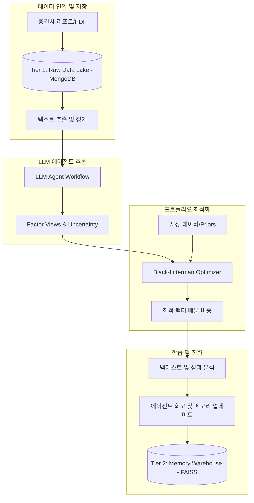
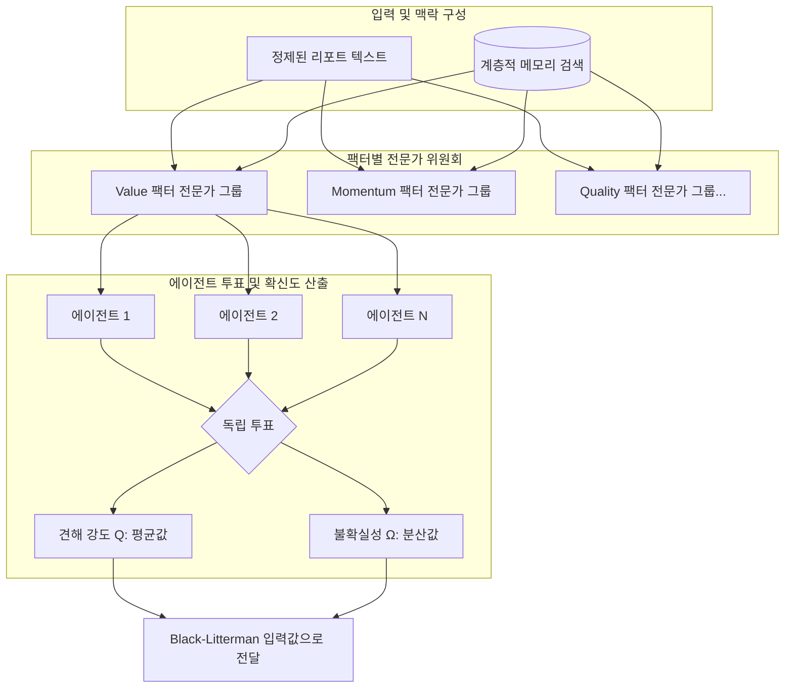

# Factor-FinMem: 자율 학습형 팩터 자산 배분 시스템

**Factor-FinMem**은 증권사 리포트와 같은 비정형 금융 데이터를 LLM 에이전트를 통해 정량적 견해(View)로 변환하고, 이를 **Black-Litterman** 모델을 통해 시장 균형과 결합하여 최적의 팩터 배분 전략을 도출하는 시스템입니다.

---

## 🌟 프로젝트 개요

이 프로젝트는 금융 전문가의 통찰력이 담긴 리포트를 단순한 텍스트로 소비하는 것이 아니라, 각 팩터별 전문가 페르소나를 가진 에이전트 그룹이 이를 독립적으로 해석하여 투자 신호를 생성합니다. LLM의 판단에만 100% 의존하는 리스크를 방지하기 위해, 에이전트의 확신도(Belief)를 통계적 프레임워크인 Black-Litterman 모델에 반영하여 최종 포트폴리오를 구성합니다.

### 📚 FinMem 논리 기반
본 프로젝트는 다음 논문의 핵심 아키텍처를 팩터 투자 관점에서 재해석하여 차용하였습니다:

> **FinMem: A Performance-Enhanced LLM Trading Agent with Layered Memory and Character Design** (Yu et al., 2023)
> [GitHub: pipiku915/FinMem-LLM-StockTrading](https://github.com/pipiku915/FinMem-LLM-StockTrading)

**차용 및 개선 사항:**
- **계층적 메모리 구조 (Layered Memory)**: FinMem의 핵심인 Shallow(단기), Intermediate(중기), Deep(장기/회고) 메모리 계층을 구현하여 정보의 시급성과 중요도를 관리합니다.
- **페르소나 설계**: 에이전트에게 특정 금융 도메인 지식과 위험 성향을 부여하는 설계를 차용했습니다.
- **Black-Litterman 결합 (핵심 차별점)**: 원작이 개별 종목의 직접 매매에 집중했다면, 본 프로젝트는 LLM이 생성한 견해($Q$)와 불확실성($\Omega$)을 **Black-Litterman** 모델의 입력값으로 사용하여 시장 데이터와 통계적으로 결합함으로써 의사결정의 안정성을 확보했습니다.

---

## 🔄 시스템 워크플로우 (Workflow Overview)

전체 시스템은 비정형 데이터의 인입부터 최종 자산 배분까지 3단계 데이터 계층을 따라 흐릅니다.



---

## 🧠 LLM 에이전트 워크플로우 (LLM Agent Workflow)

전체 프로세스 중 LLM이 비정형 데이터를 해석하여 정량적 지표로 변환하는 핵심 단계입니다. 13개의 팩터별 전문가 위원회가 독립적으로 작동합니다.



### 핵심 메커니즘
1.  **팩터 전문가 분화**: 모든 팩터를 하나의 LLM이 판단하지 않고, 가치(Value), 모멘텀(Momentum), 퀄리티(Quality) 등 13개 팩터 테마별로 특화된 에이전트 위원회를 구성합니다.
2.  **집단 지성 및 불확실성 측정**: 각 위원회 내의 다수 에이전트가 동일한 맥락에서 독립적으로 투표(+1, 0, -1)를 수행합니다. 투표의 평균은 견해의 방향($Q$)이 되고, 투표 결과의 분산은 해당 견해의 불확실성($\Omega$)으로 정량화됩니다.
3.  **지식의 신뢰도 관리**: 에이전트는 과거 자신의 예측과 실제 시장 결과를 비교하는 회고(Reflection) 과정을 통해 메모리에 저장된 정보의 신뢰도 점수를 스스로 갱신합니다.

---

## 🏗️ 아키텍처 (Architecture)

- **Tier 1 (Raw Data Lake)**: MongoDB를 사용하여 원본 텍스트와 메타데이터를 영구 보존합니다.
- **Tier 2 (Memory Warehouse)**: FAISS 기반 벡터 DB로, 정보의 시점과 중요도에 따른 계층적 검색을 지원합니다.
- **Tier 3 (Structured Mart)**: 에이전트의 판단 기록, 팩터 수익률, 성과 지표를 Parquet 형태로 관리합니다.
- **Orchestration**: **LangGraph**를 사용하여 에이전트 간의 복잡한 추론 루프와 상태 관리를 제어합니다.

---

## 🚀 시작하기

본 프로젝트는 **uv**를 패키지 매니저로 사용합니다.

```powershell
# 의존성 설치
uv sync

# 시스템 실행
uv run python -m src.main
```
