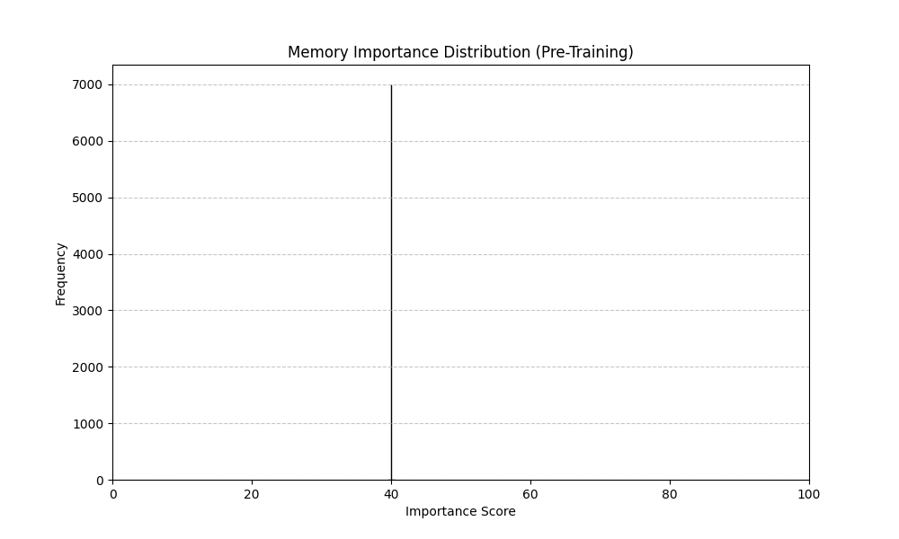
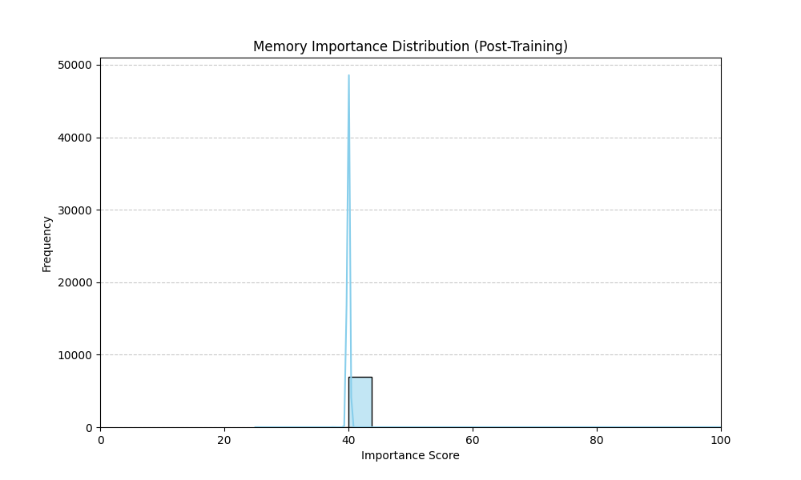
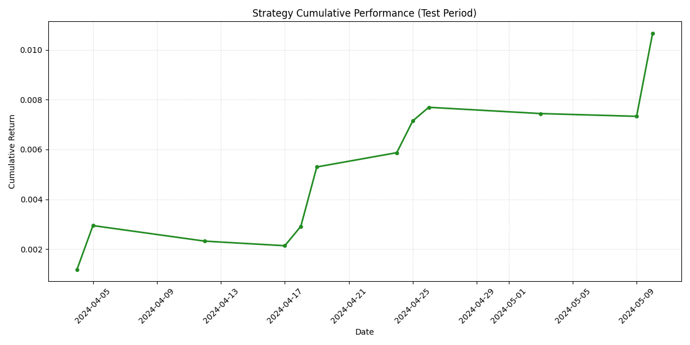

# Factor-FinMem: 자율 학습형 팩터 자산 배분 시스템

**Factor-FinMem**은 비정형 금융 리포트를 LLM 에이전트 위원회를 통해 정량적 팩터 견해($Q$)와 불확실성($\Omega$)으로 변환하고, 시장 피드백을 통해 지식을 스스로 갱신하는 퀀트 투자 시스템입니다. **FinMem** 아키텍처를 기반으로 설계되어, 과거 예측의 정확도에 따라 정보의 중요도를 동적으로 조정하는 자율 진화형 장기 기억(Long-term Memory) 메커니즘을 핵심으로 합니다.

---

## 분석 및 운용 프로세스

시스템은 매 거래일마다 비정형 데이터를 정형화된 투자 비중으로 변환하는 5단계 파이프라인을 수행합니다. 아래는 테스트 기간(2024-05-10)의 실제 운용 로그입니다.

### 1. 일일 분석 파이프라인
```text
################################################################################
                                DATE: 2024-05-10        
################################################################################

[Step 1] Fetching Today's Reports...
(v) Found 1 daily reports.

[Step 2] Retrieving Long-term Memory (FinMemRAG)...     
  - Document 0: 20220331_4월 월간전망... (S:0.47, R:0.00, I:1.00 | Total: 1.47)     
  - Document 1: 20220921_키움 데일리... (S:0.46, R:0.00, I:0.90 | Total: 1.36)
  ...
(v) Retrieved 5 relevant documents.

[Step 3] Executing Agentic Committees & Reflection...   

[Step 4] Committee Results & Votes:
  - ACCRUALS     | Q: -1.00 (Bias) | Ω: 0.00 (Uncert) | Votes: [-1, -1, -1, -1, -1]
  - VALUE        | Q: +1.00 (Bias) | Ω: 0.00 (Uncert) | Votes: [1, 1, 1, 1, 1]
  - QUALITY      | Q: +0.60 (Bias) | Ω: 0.24 (Uncert) | Votes: [1, 0, 1, 1, 0]
  ...

[Step 5] Portfolio Optimization & Performance:
  Factor          | Weight     | Return
  -----------------------------------------
  value           |     15.81% |    +0.0143
  accruals        |    -15.81% |    +0.0008
  low_leverage    |    -12.36% |    -0.0076
  ...
  -----------------------------------------
  DAILY RETURN    |    +0.0033
  CUMULATIVE      |    +0.0107
```

---

## 핵심 메커니즘: FinMem 기반 자율 진화

Factor-FinMem의 차별점은 실제 시장 수익률(`actual_return`)을 바탕으로 지식 베이스를 스스로 정교화하는 **회고(Reflection)** 레이어에 있습니다.

### 1. 지식 중요도(Importance) 갱신
학습 모드에서 에이전트는 자신의 예측과 실제 결과를 비교하여, 예측에 기여한 '신호(Signal)' 문서의 중요도를 높이고 '소음(Noise)' 문서에는 페널티를 부여합니다.

```text
    [REWARD] Reflection Result for quality: REWARD (Correct Bullish)    
      - Prediction (Q): +0.8000, Actual Return: +0.0035
      - Feedback Score: +1.0        
      - Summary: 불확실성 시기에는 수익성과 안정성이 높은 기업을 선호하는 시장 특성이 반영됨.

    [Memory Update] Aggregating updates for 9 citations...
      [INCREASE] Doc doc_0 (20220331_4월 월간전망...): Importance 97.5 -> 100.0 (AC: 16.5 -> 18.5)
      [INCREASE] Doc doc_2 (20230228_23.3월전략...): Importance 75.0 -> 87.5 (AC: 7.0 -> 9.5)
```

### 2. 학습에 따른 메모리 진화 (Distribution Change)
학습 루프를 거치며 40.0으로 균일했던 지식들의 중요도가 예측 기여도에 따라 재배치됩니다. 이는 검색 시 **Importance-weighted Retrieval**에 반영되어 의사결정의 질을 높입니다.

| 학습 전 중요도 분포 (Baseline) | 학습 후 중요도 분포 (Evolved) |
| :---: | :---: |
|  |  |

---

## 전략 성과 검증

학습 기간(2024.02.25 ~ 2024.04.03) 동안 진화한 메모리를 사용하여, 미학습 기간(2024.04.04 ~ 2024.05.15)에 대해 시뮬레이션을 수행한 결과입니다. 최종 누적 수익률 **+1.07%**를 기록했습니다.



---

## 시스템 아키텍처

### 데이터 레이어 (3-Tier)
- **Tier 1 (Raw Data Lake)**: MongoDB - 비정형 리포트 원본 및 기초 메타데이터 관리.
- **Tier 2 (Memory Warehouse)**: FAISS - 계층적(Shallow, Intermediate) 벡터 저장소 및 자율 진화형 RAG.
- **Tier 3 (Structured Mart)**: Parquet - 시계열 팩터 수익률(JKP) 및 성과 지표.

### 추론 및 최적화 오케스트레이션
- **LangGraph**: 상태 머신 기반의 추론 제어 (Retrieve → Analyze → Generate → Reflect).
- **Ensemble Committees**: 13개 팩터별 독립 위원회를 운영하여 예측의 평균($Q$)과 불확실성($\Omega$)을 정량화.
- **Black-Litterman Model**: 에이전트의 견해를 시장 균형과 결합하여 안정적인 자산 배분 가중치 도출.

---

## 설치 및 실행

### Prerequisites
- **uv** (Python 패키지 매니저)
- MongoDB 인스턴스
- OpenAI API Key

### Quick Start
```powershell
# 의존성 설치
uv sync

# 자율 진화 학습 루프 실행 (메모리 업데이트)
uv run python -m scripts.train_reflection_loop --mode train

# 테스트 기간 성과 검증 및 결과 시각화
uv run python -m scripts.train_reflection_loop --mode test
```
