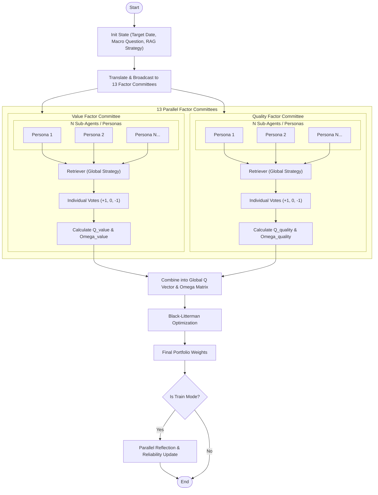

# Factor-FinMem Architecture Design

## 1. Overview

**Factor-FinMem** is an autonomous factor allocation system that leverages LLM-based macro analysis and self-evolving memory. This document defines the system structure, data flow, and agentic workflows using a modular and hierarchical approach.

## 2. 3-Tier Data Architecture

To ensure data integrity, search efficiency, and analytical performance, the system utilizes three distinct storage layers.

| Tier | Name | Technology | Purpose |
| :--- | :--- | :--- | :--- |
| **Tier 1** | **Raw Data Lake** | MongoDB | Permanent storage of raw PDF texts and metadata. |
| **Tier 2** | **Memory Warehouse** | FAISS / Chroma | Hierarchical vector storage (Working, Shallow, Deep) for RAG. |
| **Tier 3** | **Structured Mart** | Parquet Files | Time-series factor returns (JKP) and agent performance logs. |

---

## 3. Component Design

### 3.1. Modular RAG (Strategy Pattern)

The retrieval logic is decoupled from the agents. A global RAG strategy is injected into all agents during execution to ensure consistency and facilitate comparison between different RAG methods.

- **Naive RAG**: Standard similarity-based retrieval.
- **Agentic RAG (CRAG/Self-RAG)**: LLM-based relevance grading and query rewriting.
- **FinMem RAG**: Score-based retrieval using Recency, Importance, and Reliability.

### 3.2. Hierarchical Committee Ensemble

The system manages **13 Factor Theme Committees** (e.g., Value, Quality, Momentum). Each committee consists of multiple **Sub-Agents (Personas)** with unique risk profiles and knowledge bases.

- **Persona**: A specialized system prompt (e.g., "Contrarian Value Analyst").
- **Consensus**: Individual votes (+1, 0, -1) are aggregated to derive $Q$ (Mean) and $\Omega$ (Variance).

### 3.3. Core Engine

- **Black-Litterman Optimizer**: Combines agent views with market priors from JKP data.
- **Backtest Engine**: Measures performance and generates ground truth for reflection.

---

## 4. Agentic Workflow (LangGraph)

The following diagram illustrates the parallel and hierarchical execution flow of the system.

---

## 5. Memory & Reflection (Train Mode Only)

Reflection is a post-execution process used to improve the system's "intelligence" over time.

1. **Evaluation**: Compare `agent_predictions` with actual `factor_returns` from Parquet.
2. **Reliability Adjustment**: Increase/decrease the reliability score of memory nodes used in successful/failed predictions.
3. **Deep Memory Generation**: Create "Extended Reflections" (Rationale analysis) and store them in the `DEEP` layer for future reference.

---

## 6. Monitoring & Tracing

- **LangSmith**: Used for full-trace visualization of the LangGraph DAG, debugging node outputs, and evaluating RAG performance.
- **Visualization**: LangGraph's internal graph visualization tools will be used to verify the 13-committee fan-out structure.
