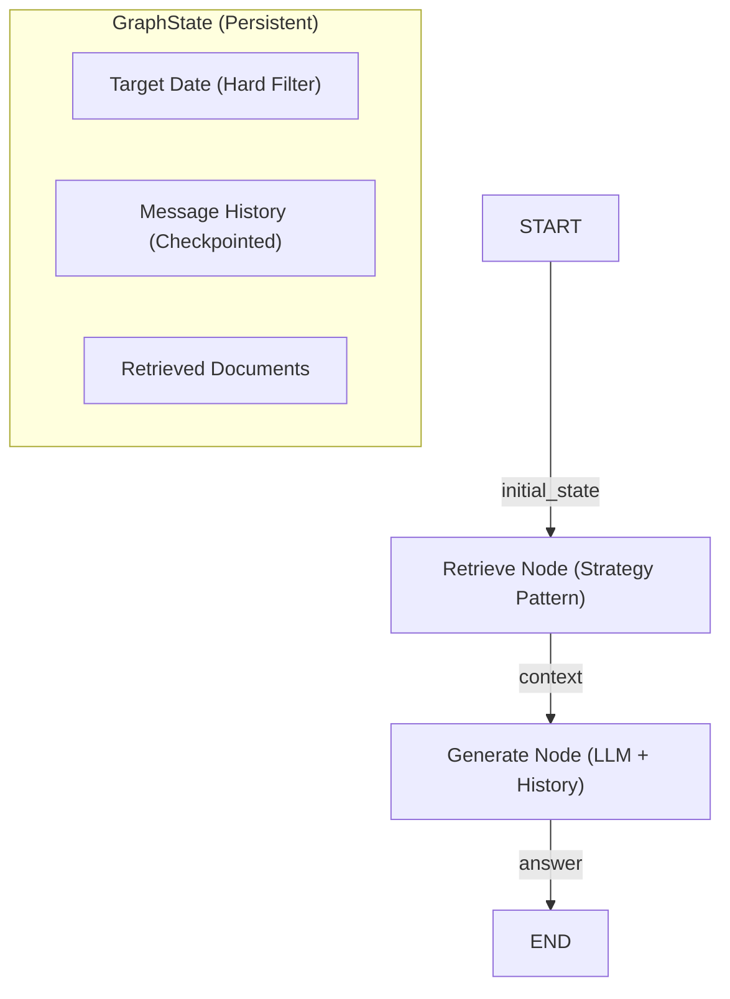
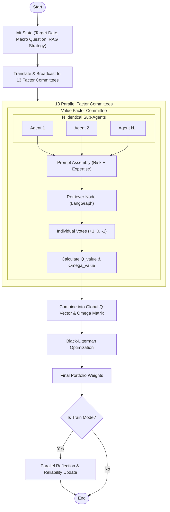

# Factor-FinMem Architecture Design

## 1. Overview
**Factor-FinMem** is an autonomous factor allocation system that leverages LLM-based macro analysis and self-evolving memory. This document defines the system structure, data flow, and agentic workflows using a modular and configuration-driven approach.

## 2. 3-Tier Data Architecture
To ensure data integrity, search efficiency, and analytical performance, the system utilizes three distinct storage layers.

| Tier | Name | Technology | Purpose |
| :--- | :--- | :--- | :--- |
| **Tier 1** | **Raw Data Lake** | MongoDB | Permanent storage of raw PDF texts and metadata. |
| **Tier 2** | **Memory Warehouse** | FAISS | Hierarchical vector storage (Shallow, Intermediate, Deep) for RAG. |
| **Tier 3** | **Structured Mart** | Parquet Files | Time-series factor returns (JKP) and agent performance logs. |

---

## 3. Component Design

### 3.1. Modular RAG (Strategy Pattern + LangGraph)
The retrieval logic is decoupled from orchestration. Retrieval is managed through a **LangGraph StateGraph**, where each step (Retrieve, Grade, Generate) is a node. The actual search logic is implemented via the **Strategy Pattern**, allowing pluggable retrieval engines.

- **Naive RAG**: Standard similarity-based retrieval with strict metadata-level date filtering.
- **Agentic RAG (CRAG/Self-RAG)**: LLM-based relevance grading and query rewriting (Planned).
- **FinMem RAG**: Score-based retrieval using Recency and Importance (Planned).

**Look-ahead Bias Prevention**: A `target_date` is maintained in the `GraphState`. The RAG Strategy uses this date to perform a **Hard Filter** on vector database metadata, ensuring only historically valid documents are retrieved.

### 3.2. Factor Theme Committee (Ensemble for Uncertainty)
The system manages **13 Factor Theme Committees** (e.g., Value, Quality, Momentum). Each committee consists of multiple **Identical Sub-Agents** to quantify the model's confidence.
- **Identical Experts**: Sub-agents within a committee receive the **exact same prompt and context**.
- **Uncertainty Quantification**: 
    - **View Magnitude ($Q_i$)**: Mean of the individual votes (+1, 0, -1).
    - **Uncertainty ($\Omega_i$)**: Variance of the individual votes. A high variance indicates the LLM is unsure or the context is ambiguous.

### 3.3. Prompt Assembly Engine (Builder Pattern)
System prompts are dynamically assembled from modular components to ensure consistency across the committee.
- **Risk Profile (Dynamic)**: Selected based on portfolio performance (e.g., Risk-Averse vs. Risk-Seeking).
- **Factor Expertise (Domain)**: Specialized domain knowledge for each of the 13 factor themes.

### 3.4. Core Engine
- **Black-Litterman Optimizer**: Combines committee views ($Q, \Omega$) with market priors.
- **Backtest Engine**: Measures performance and generates ground truth for reflection.

---

## 4. Configuration Layer (Modular YAML)
Settings are managed through modular YAML files to ensure scalability.
- `configs/agents.yaml`: Defines the committees and the number of sub-agents per committee.
- `configs/prompts/risk_profiles.yaml`: Defines dynamic risk behavior logic.
- `configs/prompts/factor_expertise.yaml`: Contains detailed domain knowledge for each factor theme.

---

## 5. Agentic Workflow (LangGraph)

The system utilizes **LangGraph** to orchestrate complex agentic flows. The state is maintained in a `GraphState` object and persisted using a `MemorySaver` checkpointer.

### 5.1. RAG Pipeline Flow
The basic RAG pipeline is implemented as a linear `StateGraph` with strict temporal constraints.



### 5.2. Global Committee Workflow
The overall portfolio construction process follows a broadcast-and-aggregate pattern.



---

## 6. Design Patterns
- **Strategy Pattern**: Modular RAG strategies injectable into LangGraph nodes.
- **State Pattern**: Graph-based state management via LangGraph `StateGraph`.
- **Factory Pattern**: Dynamic creation of committees and agents from YAML configurations.
- **Builder Pattern**: Dynamic assembly of system prompts from modular fragments.
- **Repository Pattern**: Abstracted data access for MongoDB, Vector DB, and Parquet.

---

## 7. Directory Structure
```text
src/
├── core/                # Pure logic (Optimization, Evaluation, Domain Models)
├── agents/              # Agent layer
│   ├── factory.py       # Factory for creating Committees/Agents
│   ├── prompt_builder.py# Builder for modular prompt assembly
│   ├── committee.py     # Committee aggregation logic (Mean/Var)
│   └── agent.py         # Base Agent class
├── rag/                 # Strategy pattern for retrieval
│   ├── base.py          # Abstract base class
│   └── strategies/      # Specific retrieval implementations (Naive, etc.)
├── db/                  # Data access layer (Repository pattern)
└── graph/               # LangGraph orchestration
    ├── state.py         # GraphState definition
    ├── builder.py       # Graph compilation logic
    └── nodes/           # Node implementations (Retrieve, Generate, etc.)
```
